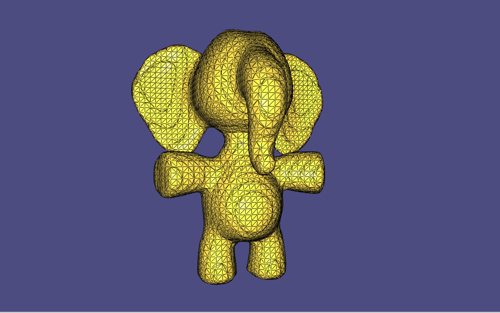

# Geometric Shape Modeling (USC CSCI 599 30015D, spring semester 2024)

## Exercise 1 Introduction

## Exercise 2 Poisson Surface Reconstruction

## Exercise 3 Registration

## Other

### Bounding Volume Hierarchy

#### Ray-Mesh Intersection

#### Point-Point Distance 

#### Mesh-Mesh Intersection

